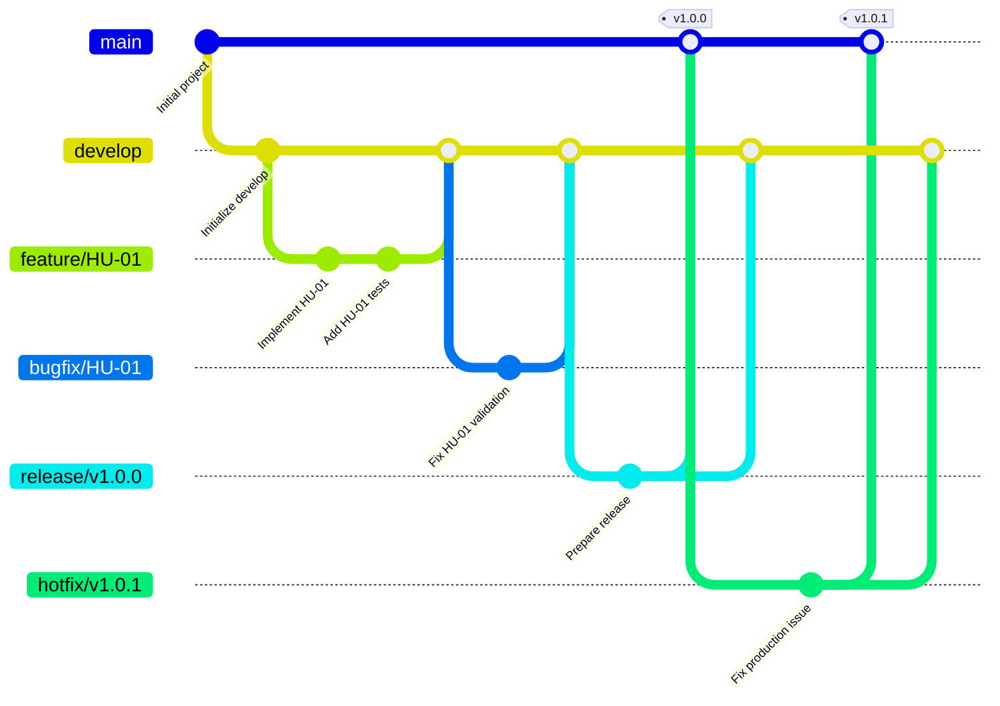

# AgroValle Connect

## Descripción
Aplicación web empresarial (desarrollada en Java 17 / Spring Boot) que busca transformar la cadena de suministro agroalimentaria regional al eliminar la intermediación innecesaria.

## 📌 Visión del Producto
**AgroValle Connect**. Su propósito es conectar de forma directa la oferta agrícola de las fincas del Valle del Cauca con la demanda comercial urbana de municipios como Cali o sus alrededores, garantizando un comercio más justo, eficiente y transparente para productores y compradores. Todo mediante una plataforma que es accesible y fácil de manejar para los usuarios, destacando las diferentes formas de ventas agrícolas tradicionales, compartiendo además calidad y experiencias tanto con clientes como vendedores.

---

##  Integrantes
- Ethan Alejandro Mezu Quizaboni
- Julián David Peña Chocue
- Bairon Palacios Urrutia
- Nicolle Mera Gomez

---

## Estrategia de Ramificación (Git Flow)

Git Flow es una estrategia muy sencilla, clara y ordenada para equipos que especialmente se encuentran en etapa de aprendizaje. Además, trabajar con el flujo de control de versiones estructurado facilita la gestión de funcionalidades nuevas, correcciones y versiones que se encuentren en producción. También ayuda a mantener una comunicación constante con el equipo sobre cada cambio que se vaya realizando, reduciendo así la probabilidad de errores en la rama `main`.

**Guía rápida de ramas:**

- `main`: Contiene únicamente código estable y listo para producción.
- `develop`: Rama principal de integración donde se consolidan todas las nuevas funcionalidades antes de su liberación.
- `feature/*`: Ramas derivadas de `develop` para desarrollar una Historia de Usuario o tarea específica. Se recomienda utilizar nombres descriptivos.
- `hotfix/*` / `bugfix/*`: Ramas dedicadas a la corrección rápida de errores en producción o en etapas de integración.

>[!IMPORTANT]
> - No trabajaremos directamente sobre `main` ni `develop`.
> - Para cada tarea o Historia de Usuario creamos una rama `feature/*`. Evitar crear ramas demasiado generales.
> - Los mensajes de commit se escribirán en inglés siguiendo Conventional Commits.
> - Los nombres de las ramas pueden utilizar español e inglés, siempre que sean descriptivos y consistentes.
> - Luego de trabajar en las ramas creadas, hacemos un Pull Request hacia `develop`.
> - Cualquier duda, contactarse con un integrante de equipo antes de hacer algún cambio.
---

### Diagrama del Flujo de Ramas (Mermaid)



---
## Configuración de la base de datos

El proyecto utiliza PostgreSQL y requiere configurar las siguientes variables de entorno:

```bash
export DB_USERNAME=postgres
export DB_PASSWORD='TU_CONTRASEÑA_DE_POSTGRES'
```
**Nota:** No se debe subir la contraseña real al repositorio. Cada desarrollador debe configurar sus propias variables de entorno localmente.